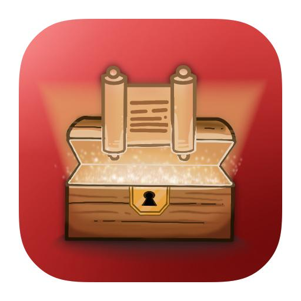

<h1> TrunkProjetoIntegradorDH </h1>

    

<!--
Badges
badges fom https://github-badges.netlify.app/

-->

## ABOUT THE PROJECT
Read a news that you like about the world of tecnologie , Geek and sience;

## MAIN FEATURES
- Create a account.
- Follow the best information from geek, science and technology.
- Read news 
- Update on realtime with RSS

## AUTHORS
Paolo, paolo.prodossimo.lopes@gmail.com 
Marcelo, marceloabisquarisi@gmail.com 
Raphael, rap.oliveira@usp.br

## LICENSE
Trunk is available under the MIT license. See the LICENSE file for more info.
